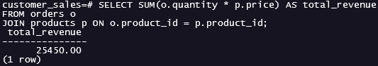
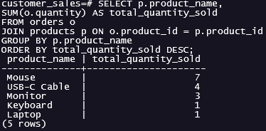
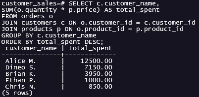
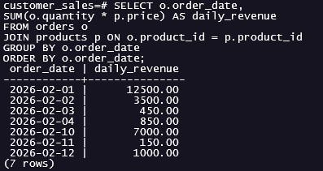

# Results Summary: Customer Sales Analysis.

## Key Findings:
- **Total Revenue Generated:** R25 450.00
- **Top Product by Quantity Sold:** Mouse (7 units sold).
- **Top Customer by Total Spend:** Alice M. (R12 500.00 spent).
- **Revenue Concentration:** A significant portion of revenue occurred on 2026-02-01, this indicates reliance on high-value transactions rather than steady daily sales.

---

## Business Insights:
- Revenue is driven more by high-ticket purchases than by high-volume products.
- A small number of customers contribute a large share of total revenue, suggesting customer concentration risk.
- Daily revenue is uneven, meaning overall performance depends on specific transaction days.

---

## Evidence (Query Outputs):
### Total Revenue:

### Top Products:

### Top Customers:

### Revenue by Date:

---

## Limitations:
- Dataset is small and simplified for demonstration purposes.
- No customer segmantation or long-term trend analysis was performed.
